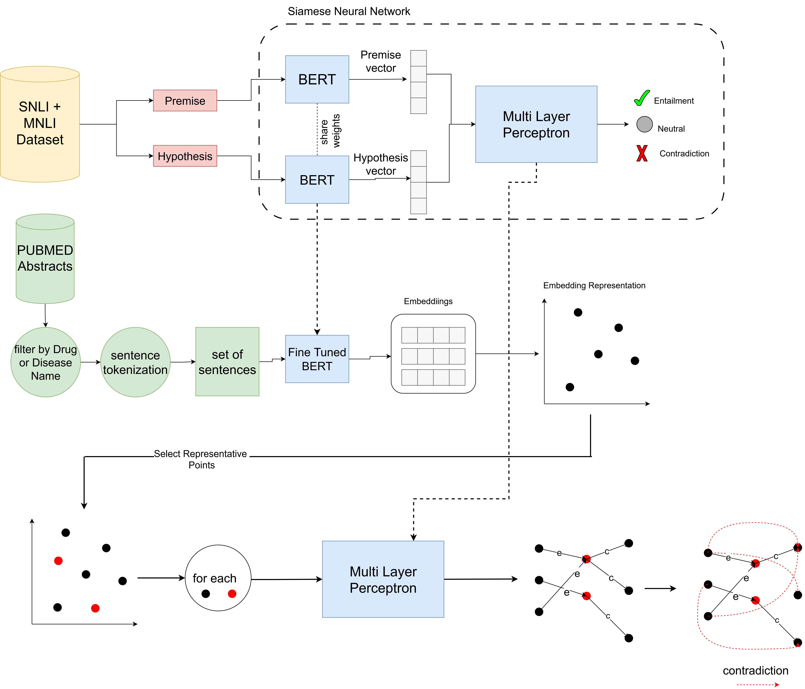

# CETaD: Contradiction Extraction from Textual Data using Siamese Network Embeddings


This is the implementation of the paper CETaD: Contradiction Extraction from Textual Data using Siamese Network Embeddings.


## Overview


### siamese network training

To train Siamese network use following command

```bash
python train_siamese_network.py \
    --model_name_or_path roberta-large \
    --data SNLI MNLI \
    --tokenizer_max_length 128 \
    --epochs 6 \
    --learning_rate 2e-5 \
    --no_unfreeze_layer 6 
```
more arguments to customize training siamese network and arguments demonstrations can be found in 
``train_siamese_network.py`` file.

### Compute p
PPMI
to computing PPMI for each term in training data you should use following command
```bash
python compute_ppmi.py \
  --data SNLI MNLI \
  --min_freq 10 \
  --output_path ./ppmi 
```
this will store ppmi.pkl and terms.pkl file in output_path which can be used in contradiction extraction ranking. Consider that the values of stored ppmi's are summed with 1 based on paper details.

### extract contradictory pairs
to extracting contradictory sentence pairs run following command
```bash
python extract_contradictory.py \
  --data_path your_data_path \
  --checkpoint_path your_checkpoint_path \
  --output_file_path ./results \
  --representative_point_type Mean \
  --terms_pickle_path path_to_terms.pkl \
  --pmi_pickle_path path_to_pmi.pkl \
  --e_th 0.5 \
  --c_th 0.5 \
  --similarity_factor 0.3 \
  --probability_factor 0 \
  --bias_factor 0.8 \
  --length_factor 0.1 \
  --number_of_extractions 50  
```
arguments demonstrations can be found in `extract_contradictions.py` file.

### Bugs or questions?

If you have any questions related to the code or the paper, feel free to email Amirhossein Derakhshan (`am_derakhshan@comp.iust.ac.ir` or `ahderakhshan.ce@gmail.com`). If you encounter any problems when using the code, or want to report a bug, you can open an issue. Please try to specify the problem with details so we can help you better and quicker!
